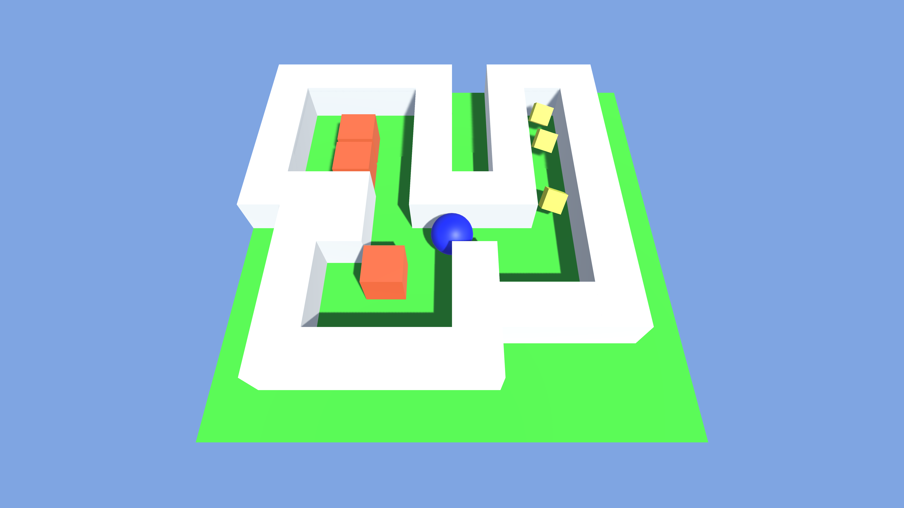
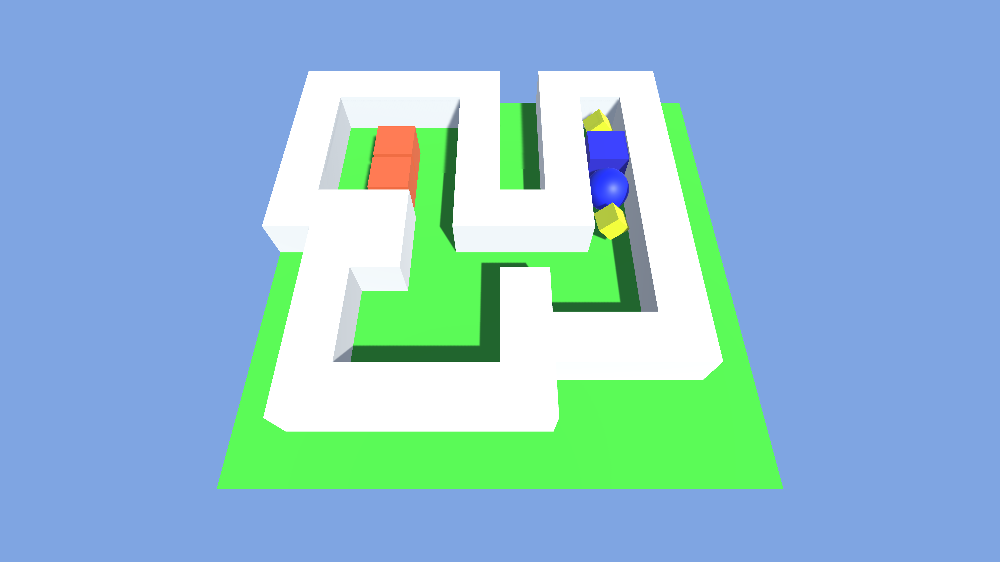
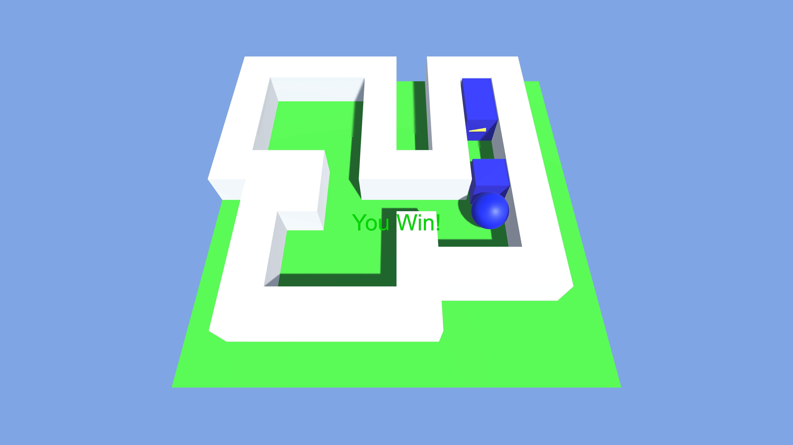

# Sokovan Game (소코반/창고지기 게임)
## ABOUT THIS GAME (게임 설명)

간단한 유니티 기반 소코반(창고지기) 게임이다.

플레이어를 조작하여 모든 박스들을 다이아몬드 표시 위로 옮기면 승리한다.

`Sokovan.app` 파일은 `Mac OS` 에서 동작한다.

---

Simple Unity based Sokovan game.

Move all boxes to diamons and win.

`Sokovan.app` file runs on `Mac OS` .

## GAME CONTROLS (조작법)

- `w` `a` `s` `d` 키 또는 방향키:
  - 플레이어 이동
- `spacebar`:
  - 게임 재시작

---

- `w` `a` `s` `d` keys or arrow keys:
  - Move player
- `spacebar`:
  - Restart game

## GAME PLAY SCREENSHOTS (스크린샷)

